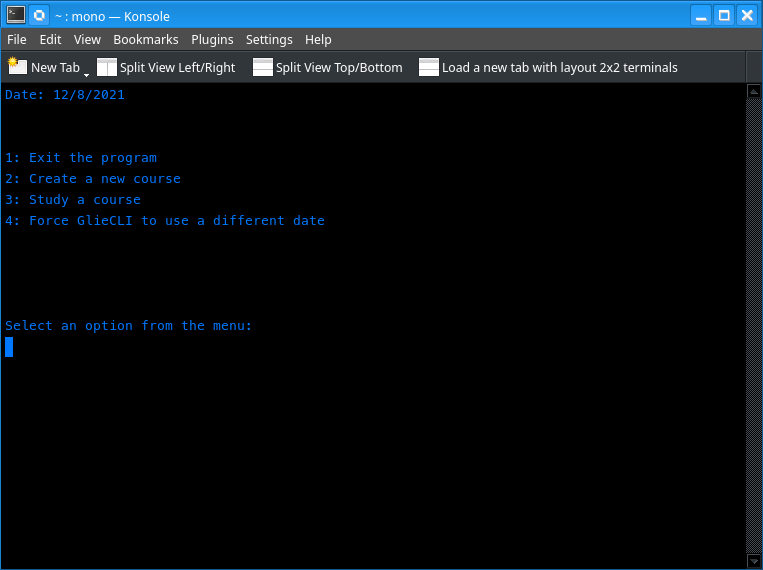
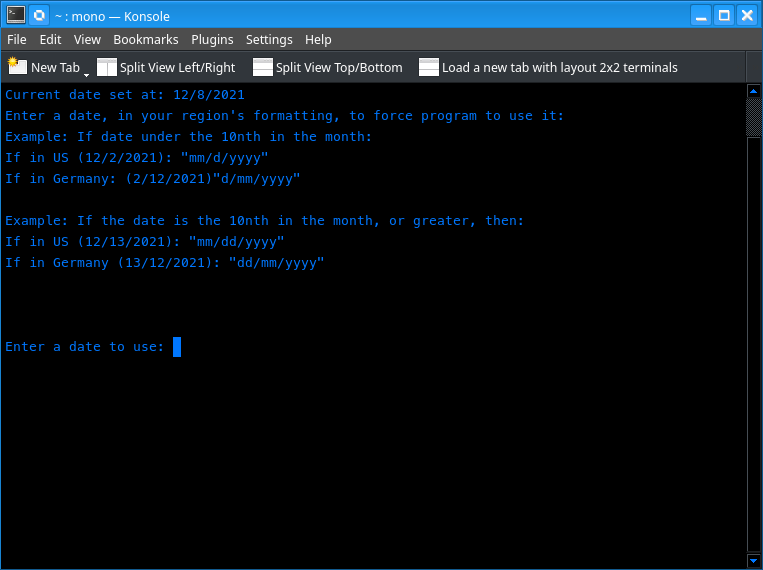

# Update Dec 3rd 2021: Date Reinforcment - Win earlier completion dates!

I thought it would be more reinforcing to see how many repetitions I need to complete the predicted date. Then I thought it would be cool to see if I could win an earlier completion date! 

# About
Glide allows people who use it to study more efficiently, and learn at a very fast rate. 

# GlideCLI now does these things:
* display number of topics left
* allows user to switch topics
* exit from menu
* Change number of total questions on first study of a topic
* Predicts the date a course will be completed by.
* Allows users to win earlier completion dates.
* Now allows user to change the current date back to the previous, in case the study session starts after midnight. I also use this for debugging.

GlideCLI is a command line interface application:
(You might need to modify the size of your command line window to see everything in the Study HUD, until the graphical user-interface version is ready.)

## Screenshots

Main Menu

The Study HUD

New Date changing feature

# To Install:
GlideCLI MIGHT run on MacOS now. It WILL now run on Windows, Linux, and Docker:
(I don't have a mac, but if someone with a mac wants to try it, please tell me if it works. I am only guessing that macOS uses a Unix directory structure.)

* Step 1:
Just download Mono here for your operating system:
https://www.mono-project.com/download/stable/#download-lin

* Step 2:
Download GlideCLI from the release page here:
https://github.com/Dartomic/GlideCLI/releases/download/v0.21-alpha/GlideCLI.exe

* Step 3:
Then open a command prompt in the directory that GlideCLI.exe is in, and type
mono GlideCLI.exe

# Making a course for GlideCLI:
Making a course for GlideCLI is tedious. The two programs that are going to replace GlideCLI will be far easier to add a course in. Although the user interface looks different, since it displays a lot more information now, the instructions for adding a course are the same as before this update. The instructions are in this manual I made, which I will update at a later time to be more like a regular manual. 

Here is the link: https://github.com/Dartomic/GlideCLI/blob/master/Docs/Manual.pdf

# Difference between this software, and the research
The research currently used by most scientists for the calculation of difficulty, which is used to calculate the interval length between study sessions, it is also used in the calculation of engram stability, and it is also used in the calculation of the forgetting curve, is inaccurate. The research I am referring to, for this currently accepted calculation of difficulty can be found here: https://github.com/Dartomic/GlideCLI/blob/master/Docs/easinessFactor.pdf

I explain how the currently accepted calculation is innaccurate in the document: https://github.com/Dartomic/GlideCLI/blob/master/Docs/Differences.md

If you look at the pdf file that I linked in the about section (https://github.com/Dartomic/GlideCLI/blob/master/Docs/Manual.pdf), I go into detail to explain how the calculation of difficulty is performed in this software.

Since I realized that I am not using anyone elses research for the calculation of difficulty, and since the researchers gave a name to their calculation of difficulty in the journal article I linked to (which I mentioned is not accurate, and is therefore not used in my program), then maybe I should name the calculation of difficulty in GlideCLI. It does not exactly feel right to do this, because I am just using the Slope-Intercept formula. But I decided to give it a name anyway, to distinguish this way of calculating difficulty from the way that it is calculated by the researchers. I'm naming it "Spacing Multiplyer". 

The name Spacing Multiplier is not mentioned in the source code yet, because after I have been using it for three years, I just realized that I should name it. I'll edit the name in the source code to reflet this in the next update I give to the program, with a couple of additional features for enhancing the completion date prediction algorithm.

# The Forgetting Curve
GlideCLI does calculate the forgetting curve, and uses the formula from this research:

https://github.com/Dartomic/GlideCLI/blob/master/Docs/5535.pdf

Other than calculating the forgetting curve, and storing the result in a file, this calculation, and the result that it produces, is not actually used for anything yet.
